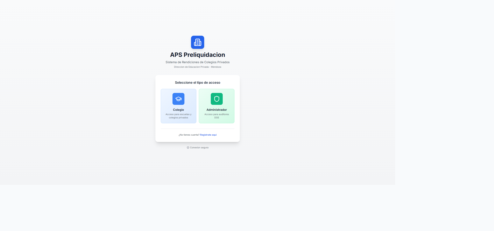
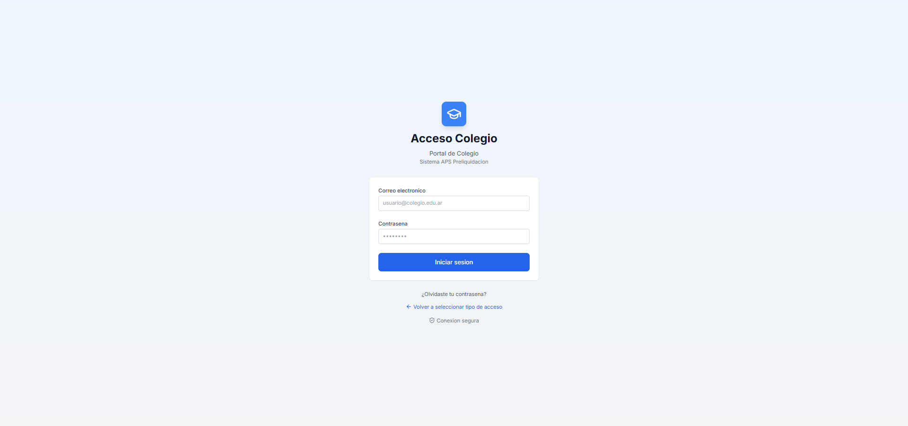
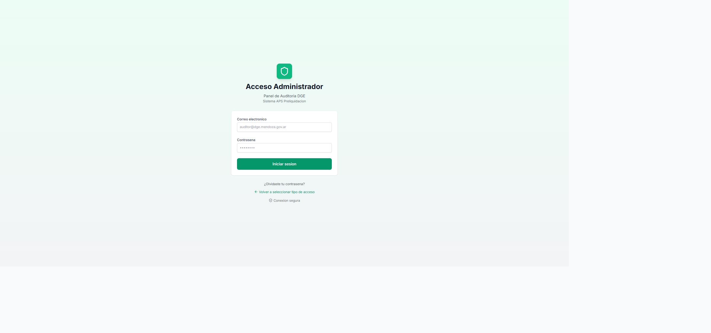
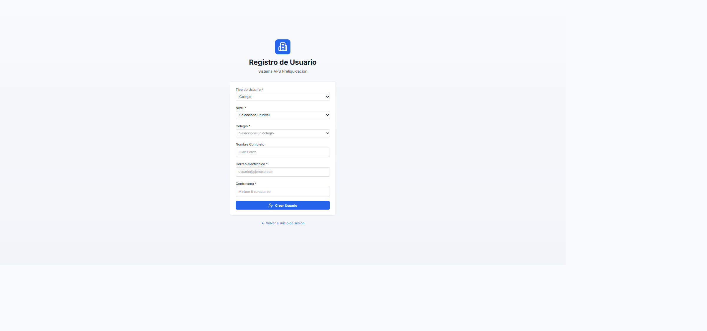
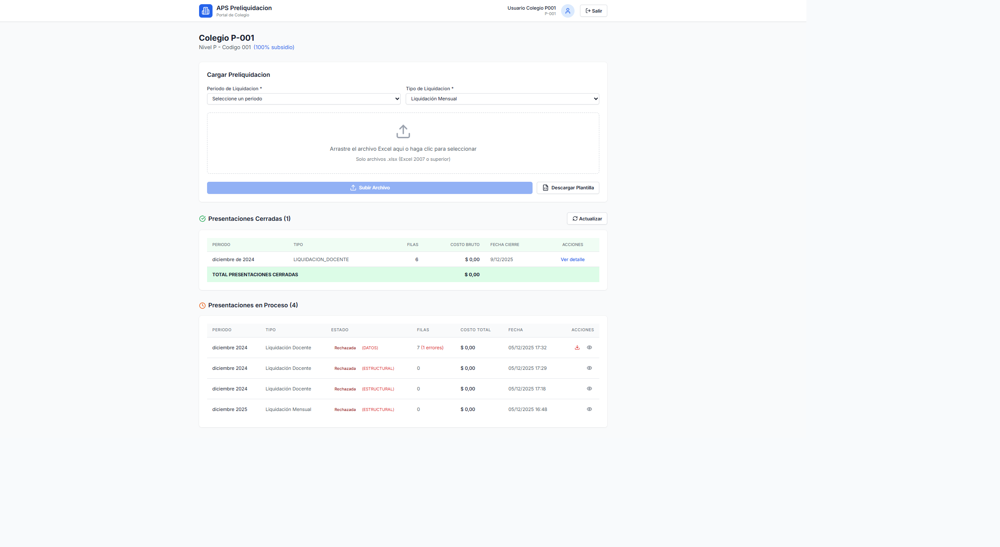
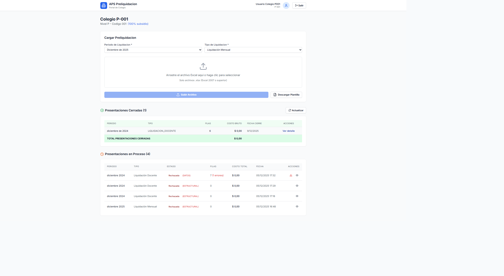
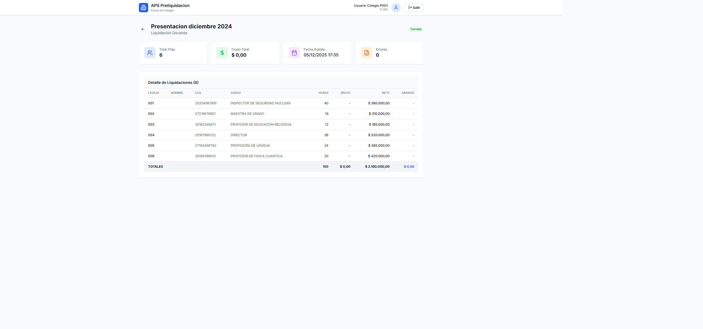
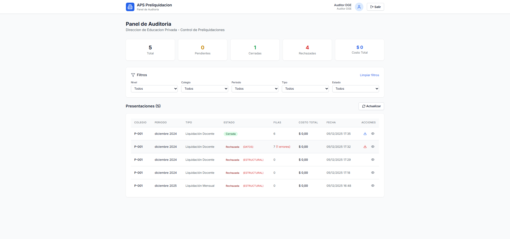
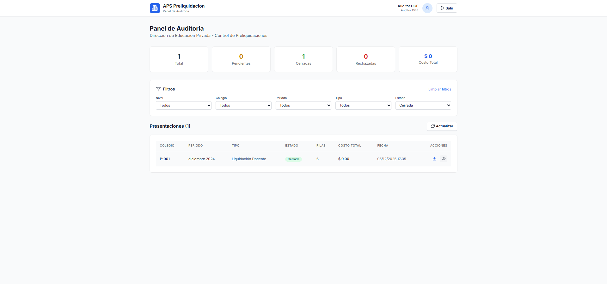

# Manual de Usuario

## PRELIQ-DGE
### Sistema de Preliquidaciones Colegios Privados
#### Direccion General de Escuelas - Mendoza

---

## Credenciales de Acceso (Ambiente de Demostracion)

| Rol | Email | Contraseña |
|-----|-------|------------|
| **Administrador/Auditor DGE** | `auditor.dge@gmail.com` | `Test123456` |
| **Colegio (P-001)** | `colegio.p001@gmail.com` | `Test123456` |

> **Nota**: Estas credenciales son para el ambiente de demostracion. En produccion, cada usuario tendra sus propias credenciales asignadas por la Direccion de Educacion Privada.

---

## Tabla de Contenidos

1. [Introduccion](#1-introduccion)
2. [Acceso al Sistema](#2-acceso-al-sistema)
3. [Registro de Usuarios](#3-registro-de-usuarios)
4. [Portal de Colegio](#4-portal-de-colegio)
5. [Carga de Preliquidaciones](#5-carga-de-preliquidaciones)
6. [Gestion de Presentaciones](#6-gestion-de-presentaciones)
7. [Panel de Auditoria](#7-panel-de-auditoria)
8. [Preguntas Frecuentes](#8-preguntas-frecuentes)
9. [Anexo Tecnico](#9-anexo-tecnico)

---

## 1. Introduccion

### Objetivo del Sistema

**PRELIQ-DGE** (Sistema de Preliquidaciones Colegios Privados) fue desarrollado con el objetivo de **digitalizar y optimizar el proceso de rendicion de liquidaciones de personal** de los colegios privados subvencionados de la Provincia de Mendoza.

Actualmente, el proceso de presentacion de preliquidaciones se realiza de forma manual, lo que genera:
- Demoras en la recepcion y procesamiento de la informacion
- Errores en los datos que deben corregirse de forma iterativa
- Dificultad para consolidar informacion de multiples colegios
- Falta de trazabilidad en el estado de las presentaciones

Este sistema busca resolver estos problemas mediante:
- **Centralizacion**: Un unico punto de carga para todos los colegios
- **Validacion automatica**: Deteccion inmediata de errores en formato y datos
- **Trazabilidad**: Seguimiento completo del estado de cada presentacion
- **Eficiencia**: Reduccion de tiempos de procesamiento y comunicacion

### Descripcion General

**PRELIQ-DGE** es una plataforma web desarrollada para la Direccion General de Escuelas de Mendoza que permite a los colegios privados gestionar sus rendiciones de liquidaciones de personal de manera digital y eficiente.

### Caracteristicas Principales

- **Carga de archivos Excel**: Permite subir plantillas Excel con los datos de liquidacion del personal
- **Validacion automatica**: El sistema valida la estructura y datos del archivo automaticamente
- **Seguimiento de estados**: Las presentaciones pasan por diferentes estados (Cargada, Cerrada, Rechazada)
- **Panel de auditoria**: Los auditores de la DGE pueden revisar y controlar todas las presentaciones
- **Reportes de errores**: Generacion automatica de archivos con errores detectados

### Roles de Usuario

| Rol | Descripcion |
|-----|-------------|
| **COLEGIO** | Usuario del colegio que carga y gestiona sus propias preliquidaciones |
| **AUDITOR** | Usuario de la DGE que revisa y audita todas las presentaciones |

---

## 2. Acceso al Sistema

### Pantalla de Seleccion de Acceso

Para acceder al sistema, ingrese a la URL proporcionada por la Direccion de Educacion Privada. La pantalla inicial presenta dos opciones de acceso:



### Tipos de Acceso

| Tipo | Descripcion | Usuarios |
|------|-------------|----------|
| **Colegio** | Portal para instituciones educativas | Usuarios de colegios privados |
| **Administrador** | Panel de auditoria DGE | Auditores y personal administrativo |

### Acceso para Colegios

1. Haga clic en el boton **"Colegio"** en la pantalla de seleccion
2. Se mostrara el formulario de login con tema azul



3. **Correo electronico**: Ingrese el correo electronico registrado
4. **Contrasena**: Ingrese su contrasena
5. Haga clic en **"Iniciar sesion"**

### Acceso para Administradores (Auditores DGE)

1. Haga clic en el boton **"Administrador"** en la pantalla de seleccion
2. Se mostrara el formulario de login con tema verde



3. **Correo electronico**: Ingrese su correo institucional
4. **Contrasena**: Ingrese su contrasena
5. Haga clic en **"Iniciar sesion"**

### Opciones Adicionales

- **Olvidaste tu contrasena?**: Permite recuperar el acceso mediante correo electronico
- **Volver a seleccionar tipo de acceso**: Regresa a la pantalla de seleccion inicial
- **Registrate aqui**: Para crear una nueva cuenta de usuario (disponible en pantalla de seleccion)

### Indicadores de Seguridad

El sistema muestra un indicador de "Conexion segura" que garantiza que sus datos viajan encriptados.

---

## 3. Registro de Usuarios

### Pantalla de Registro

Si no tiene una cuenta, puede registrarse haciendo clic en "Registrate aqui" desde la pantalla de login.



### Proceso de Registro para Colegios

1. **Tipo de Usuario**: Seleccione "Colegio"
2. **Nivel**: Seleccione el nivel educativo correspondiente:
   - P - Primario
   - PE - Especial
   - PP - Primario Especial
   - PS - Secundario
   - PT - Terciario
3. **Colegio**: Seleccione su colegio de la lista (se filtra automaticamente segun el nivel)
4. **Nombre Completo**: Ingrese su nombre completo
5. **Correo electronico**: Ingrese un correo electronico valido
6. **Contrasena**: Cree una contrasena de minimo 6 caracteres
7. Haga clic en **"Crear Usuario"**

### Registro para Auditores DGE

Los auditores de la DGE seleccionan "Auditor DGE" como tipo de usuario. Este tipo de cuenta no requiere asociarse a un colegio especifico.

---

## 4. Portal de Colegio

### Dashboard Principal

Una vez iniciada la sesion como usuario de colegio, accede al dashboard principal donde puede gestionar todas sus preliquidaciones.



### Elementos del Dashboard

#### Encabezado
- **Logo del sistema**: APS Preliquidacion
- **Indicador de portal**: "Portal de Colegio"
- **Nombre de usuario**: Muestra el nombre del usuario logueado
- **Codigo de colegio**: Identificador unico del colegio (ej: P-001)
- **Boton Salir**: Para cerrar la sesion

#### Informacion del Colegio
- **Nivel**: Codigo del nivel educativo (P, PS, PT, etc.)
- **Codigo**: Numero identificador del colegio
- **Porcentaje de subsidio**: Porcentaje de subsidio estatal asignado

#### Secciones Principales

1. **Cargar Preliquidacion**: Formulario para subir nuevas liquidaciones
2. **Presentaciones Cerradas**: Lista de presentaciones ya finalizadas con su costo total
3. **Presentaciones en Proceso**: Lista de presentaciones pendientes o rechazadas

---

## 5. Carga de Preliquidaciones

### Formulario de Carga



### Pasos para Cargar una Preliquidacion

#### Paso 1: Seleccionar Periodo
Seleccione el periodo de liquidacion del desplegable. Los periodos disponibles van desde el mes actual hasta 18 meses hacia atras.

**Formato de periodos disponibles:**
- Diciembre de 2025
- Noviembre de 2025
- Octubre de 2025
- (etc.)

#### Paso 2: Seleccionar Tipo de Liquidacion
Seleccione el tipo de liquidacion correspondiente:

| Tipo | Descripcion |
|------|-------------|
| Liquidacion Mensual | Liquidacion regular del mes |
| Aguinaldo 1er Semestre | SAC correspondiente al primer semestre |
| Aguinaldo 2do Semestre | SAC correspondiente al segundo semestre |
| Suplementaria | Liquidacion adicional |
| Rectificativa | Correccion de una liquidacion anterior |
| Liquidacion Docente | Especifica para personal docente |
| Suplencias - Licencias sin Goce | Para personal en suplencia por licencias |
| Suplencias - Enfermedad/Maternidad | Para suplencias por enfermedad o maternidad |
| Maestranza SUTE | Personal de maestranza afiliado a SUTE |
| Maestranza SOEME | Personal de maestranza afiliado a SOEME |

#### Paso 3: Descargar Plantilla
Antes de cargar su archivo, descargue la plantilla oficial haciendo clic en **"Descargar Plantilla"**.

La plantilla contiene:
- Estructura de columnas requerida
- Formato de datos esperado
- Ejemplos de datos validos

#### Paso 4: Preparar el Archivo Excel
Complete la plantilla con los datos de su liquidacion siguiendo estas reglas:

**Columnas requeridas:**
| Columna | Descripcion | Formato |
|---------|-------------|---------|
| LEGAJO | Numero de legajo del empleado | Numerico |
| CUIL | CUIL del empleado | 11 digitos sin guiones |
| CARGO | Descripcion del cargo | Texto |
| HORAS | Cantidad de horas | Numerico |
| BRUTO | Sueldo bruto | Numerico decimal |
| NETO | Sueldo neto | Numerico decimal |
| ARRAIGO | Monto de arraigo | Numerico decimal |

#### Paso 5: Subir el Archivo
1. Arrastre el archivo Excel al area indicada, o haga clic para seleccionarlo
2. Solo se aceptan archivos **.xlsx** (Excel 2007 o superior)
3. Haga clic en **"Subir Archivo"**

### Validaciones del Sistema

El sistema realiza dos tipos de validaciones:

#### Validacion Estructural
- Verifica que el archivo tenga el formato correcto
- Comprueba que existan todas las columnas requeridas
- Valida el tipo de datos de cada columna

#### Validacion de Datos
- Verifica que los CUIL tengan formato valido
- Comprueba que los montos sean numericos
- Valida la coherencia de los datos

### Estados de la Presentacion

Despues de subir un archivo, la presentacion puede quedar en diferentes estados:

| Estado | Descripcion | Color |
|--------|-------------|-------|
| **CARGADA** | Archivo procesado correctamente, pendiente de cierre | Amarillo |
| **CERRADA** | Presentacion finalizada y enviada | Verde |
| **RECHAZADA** | Archivo con errores que requiere correccion | Rojo |

### Tipos de Rechazo

- **ESTRUCTURAL**: El archivo no cumple con el formato requerido
- **DATOS**: El archivo tiene errores en los datos ingresados

---

## 6. Gestion de Presentaciones

### Vista de Presentaciones

El dashboard muestra dos secciones de presentaciones:

#### Presentaciones Cerradas
Muestra las presentaciones finalizadas con:
- Periodo
- Tipo de liquidacion
- Cantidad de filas
- Costo bruto total
- Fecha de cierre
- Acciones disponibles

**Total de Presentaciones Cerradas**: Suma total de los costos de todas las presentaciones cerradas.

#### Presentaciones en Proceso
Muestra las presentaciones pendientes o rechazadas con:
- Periodo
- Tipo de liquidacion
- Estado (con motivo de rechazo si aplica)
- Cantidad de filas (y errores si los hay)
- Costo total
- Fecha de carga
- Acciones disponibles

### Detalle de Presentacion

Haga clic en **"Ver detalle"** para acceder a la informacion completa de una presentacion.



#### Informacion General
- **Periodo**: Mes y ano de la liquidacion
- **Tipo**: Tipo de liquidacion
- **Estado**: Estado actual de la presentacion
- **Total Filas**: Cantidad de registros en la liquidacion
- **Costo Total**: Suma total de la liquidacion
- **Fecha Subida**: Fecha y hora de carga del archivo
- **Errores**: Cantidad de errores detectados (si los hay)

#### Detalle de Liquidaciones
Tabla con el detalle de cada empleado:
- **LEGAJO**: Numero de legajo
- **NOMBRE**: Nombre del empleado (si esta disponible)
- **CUIL**: Numero de CUIL
- **CARGO**: Descripcion del cargo
- **HORAS**: Cantidad de horas
- **BRUTO**: Sueldo bruto
- **NETO**: Sueldo neto
- **ARRAIGO**: Monto de arraigo

#### Totales
Al final de la tabla se muestran los totales:
- Total de horas
- Total bruto
- Total neto
- Total arraigo

### Acciones Disponibles

#### Para Presentaciones CARGADAS
- **Ver detalle**: Ver informacion completa
- **Cerrar presentacion**: Finalizar y enviar la presentacion

#### Para Presentaciones RECHAZADAS
- **Ver detalle**: Ver informacion completa
- **Descargar errores**: Obtener archivo Excel con los errores detectados

#### Para Presentaciones CERRADAS
- **Ver detalle**: Ver informacion completa

### Descargar Errores

Cuando una presentacion es rechazada por errores de datos, puede descargar un archivo Excel con el detalle de los errores:

1. En la fila de la presentacion rechazada, haga clic en **"Descargar errores"**
2. Se descargara un archivo Excel con:
   - Fila del error
   - Columna afectada
   - Valor actual
   - Descripcion del error

### Cerrar Presentacion

Para finalizar una presentacion cargada:

1. Acceda al detalle de la presentacion
2. Verifique que todos los datos sean correctos
3. Haga clic en **"Cerrar Presentacion"**
4. Confirme la accion en el dialogo de confirmacion

**IMPORTANTE**: Una vez cerrada, la presentacion no puede ser modificada.

---

## 7. Panel de Auditoria

### Acceso al Panel

Los usuarios con rol **AUDITOR** acceden automaticamente al Panel de Auditoria al iniciar sesion seleccionando la opcion "Administrador" en la pantalla inicial.


### Vista General del Panel

El panel de auditoria proporciona una vista completa de todas las presentaciones de todos los colegios del sistema, permitiendo un control centralizado de las preliquidaciones.



### Funcionalidades del Panel de Auditoria

#### Estadisticas Generales (Tarjetas Superiores)
El panel muestra estadisticas en tiempo real mediante tarjetas informativas:

| Tarjeta | Descripcion | Color |
|---------|-------------|-------|
| **Total** | Cantidad total de presentaciones en el sistema | Azul |
| **Pendientes** | Presentaciones en estado CARGADA esperando cierre | Amarillo |
| **Cerradas** | Presentaciones finalizadas correctamente | Verde |
| **Rechazadas** | Presentaciones con errores de datos o estructura | Rojo |
| **Costo Total** | Suma de costos de todas las presentaciones validas | Esmeralda |

#### Sistema de Filtros Avanzados



Los auditores disponen de un completo sistema de filtros para encontrar presentaciones especificas:

| Filtro | Descripcion | Opciones |
|--------|-------------|----------|
| **Nivel** | Nivel educativo del colegio | P (Primario), PE (Especial), PP (Primario Especial), PS (Secundario), PT (Terciario) |
| **Colegio** | Codigo del colegio especifico | Lista dinamica de todos los colegios (ej: P-001, PS-025, PT-010) |
| **Periodo** | Mes y ano de la liquidacion | Ultimos 24 meses disponibles |
| **Tipo** | Tipo de liquidacion | Mensual, Aguinaldo, Suplementaria, Rectificativa, etc. |
| **Estado** | Estado actual de la presentacion | Cargada, Cerrada, Rechazada |

**Boton "Limpiar filtros"**: Restablece todos los filtros a "Todos" para ver la lista completa.

#### Tabla de Presentaciones

La tabla muestra la siguiente informacion para cada presentacion:

| Columna | Descripcion |
|---------|-------------|
| **COLEGIO** | Codigo del colegio (Nivel-Numero) |
| **PERIODO** | Mes y ano de la liquidacion |
| **TIPO** | Tipo de liquidacion presentada |
| **ESTADO** | Estado actual con indicador de motivo de rechazo |
| **FILAS** | Cantidad de registros (y errores si aplica) |
| **COSTO TOTAL** | Monto total de la liquidacion |
| **FECHA** | Fecha y hora de carga |
| **ACCIONES** | Botones de accion disponibles |

#### Estados de Presentacion Visibles

- **Cerrada** (Verde): Presentacion finalizada y valida
- **Rechazada (DATOS)** (Rojo): Errores en datos individuales - permite descargar archivo de errores
- **Rechazada (ESTRUCTURAL)** (Rojo): Error en formato del archivo - debe corregirse estructura
- **Cargada** (Amarillo): Pendiente de cierre por el colegio

#### Acciones Disponibles por Estado

| Estado | Acciones Disponibles |
|--------|---------------------|
| **Cerrada** | Ver detalle, Descargar original |
| **Rechazada (DATOS)** | Ver detalle, Descargar errores |
| **Rechazada (ESTRUCTURAL)** | Ver detalle |
| **Cargada** | Ver detalle, Descargar original |

### Boton Actualizar
El boton **"Actualizar"** permite refrescar la lista de presentaciones para ver los cambios mas recientes sin necesidad de recargar la pagina.

---

## 8. Preguntas Frecuentes

### Sobre el Acceso

**P: Olvide mi contrasena, que hago?**
R: Haga clic en "Olvidaste tu contrasena?" en la pantalla de login y siga las instrucciones para recuperarla por correo electronico.

**P: No puedo acceder con mis credenciales**
R: Verifique que este usando el correo electronico correcto y que la contrasena sea la correcta. Si el problema persiste, contacte al administrador.

### Sobre la Carga de Archivos

**P: Que formato debe tener el archivo Excel?**
R: Debe ser un archivo .xlsx (Excel 2007 o superior) con la estructura de la plantilla oficial. Descargue siempre la plantilla antes de cargar.

**P: Mi archivo fue rechazado por error ESTRUCTURAL**
R: El archivo no cumple con el formato requerido. Verifique que:
- El archivo sea .xlsx
- Contenga todas las columnas requeridas
- Los nombres de columnas coincidan exactamente con la plantilla

**P: Mi archivo fue rechazado por error de DATOS**
R: Hay errores en los datos ingresados. Descargue el archivo de errores para ver el detalle y corregirlos.

**P: Puedo modificar una presentacion cerrada?**
R: No, las presentaciones cerradas no pueden modificarse. Si necesita hacer correcciones, debera crear una nueva presentacion de tipo "Rectificativa".

### Sobre las Presentaciones

**P: Cual es la diferencia entre CARGADA y CERRADA?**
R: Una presentacion CARGADA esta procesada pero pendiente de revision final. Una vez que verifica que los datos son correctos, debe cerrarla para enviarla oficialmente.

**P: Por que no puedo cerrar mi presentacion?**
R: Si la presentacion tiene errores, debe corregirlos primero. Verifique el estado y los errores reportados.

---

## 9. Anexo Tecnico

### Ambiente de Demostracion

Este sistema se encuentra actualmente en **ambiente de demostracion** con fines de desarrollo y pruebas. La infraestructura utilizada es temporal y esta diseñada para validar el funcionamiento del sistema antes de su implementacion en produccion.

### Stack Tecnologico Utilizado (Demo)

| Componente | Tecnologia | Proposito |
|------------|------------|-----------|
| **Frontend** | Next.js 14 + React 18 | Framework web moderno con SSR |
| **Estilos** | Tailwind CSS 3 | Framework CSS utilitario |
| **Lenguaje** | TypeScript 5 | Tipado estatico para mayor robustez |
| **Base de Datos** | PostgreSQL (Supabase) | Base de datos relacional en la nube |
| **Autenticacion** | Supabase Auth | Sistema de autenticacion JWT |
| **Almacenamiento** | Supabase Storage | Almacenamiento de archivos Excel |
| **Hosting** | Vercel | Plataforma de despliegue serverless |
| **Procesamiento Excel** | ExcelJS | Lectura y generacion de archivos Excel |

### Infraestructura de Demostracion

```
┌─────────────────────────────────────────────────────────────┐
│                    AMBIENTE DE DEMO                          │
├─────────────────────────────────────────────────────────────┤
│                                                              │
│   ┌─────────────┐     ┌─────────────┐     ┌─────────────┐  │
│   │   Usuario   │────▶│   Vercel    │────▶│  Supabase   │  │
│   │  (Browser)  │     │  (Hosting)  │     │ (DB + Auth) │  │
│   └─────────────┘     └─────────────┘     └─────────────┘  │
│                                                              │
│   URL Demo: https://aps-preliquidacion-app.vercel.app       │
│                                                              │
└─────────────────────────────────────────────────────────────┘
```

### Plan de Migracion a Produccion

La arquitectura del sistema esta diseñada para ser facilmente migrable a la infraestructura propia de la DGE. El plan de migracion incluye:

#### Fase 1: Migracion de Base de Datos
| Actual (Demo) | Produccion (DGE) |
|---------------|------------------|
| Supabase PostgreSQL | SQL Server DGE |
| Supabase Auth | Active Directory / LDAP DGE |
| Supabase Storage | Servidor de archivos DGE |

#### Fase 2: Migracion de Hosting
| Actual (Demo) | Produccion (DGE) |
|---------------|------------------|
| Vercel (serverless) | Servidores Windows/Linux DGE |
| Dominio vercel.app | Dominio mendoza.gov.ar |
| SSL automatico | Certificados DGE |

#### Fase 3: Integracion con Sistemas DGE
- Conexion con sistemas de liquidacion existentes
- Integracion con base de datos de personal
- Single Sign-On con credenciales institucionales
- Backup y recuperacion segun politicas DGE

### Consideraciones para Produccion

1. **Seguridad**: Implementar VPN o acceso restringido a red interna DGE
2. **Escalabilidad**: Configurar balanceador de carga para alta disponibilidad
3. **Backup**: Politicas de respaldo diario automatico
4. **Monitoreo**: Integracion con herramientas de monitoreo institucionales
5. **Compliance**: Cumplimiento con normativas de proteccion de datos provinciales

### Ventajas del Stack Actual para Demo

- **Costo cero**: Todos los servicios utilizados tienen capa gratuita
- **Despliegue rapido**: Cambios en produccion en minutos
- **Escalabilidad automatica**: Sin preocuparse por infraestructura
- **Alta disponibilidad**: 99.9% uptime garantizado
- **Seguridad incluida**: SSL, autenticacion, RLS en base de datos

---

## Soporte Tecnico

Para consultas o problemas tecnicos, contacte a:

**Direccion General de Escuelas - Educacion Privada**
- Email: soporte@dge.mendoza.gov.ar
- Telefono: (0261) XXX-XXXX

---

*Documento generado automaticamente - Version 1.0*
*PRELIQ-DGE - Sistema de Preliquidaciones Colegios Privados*
*Direccion General de Escuelas - Mendoza*
*Ambiente de Demostracion - Diciembre 2024*
